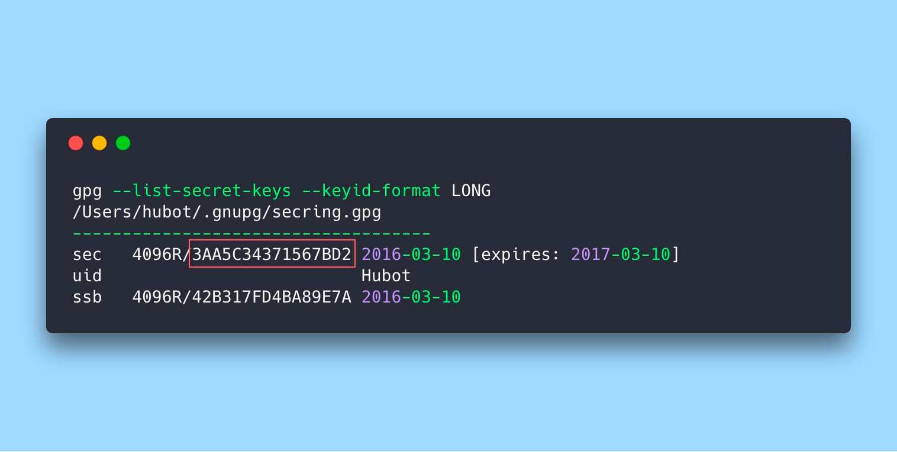
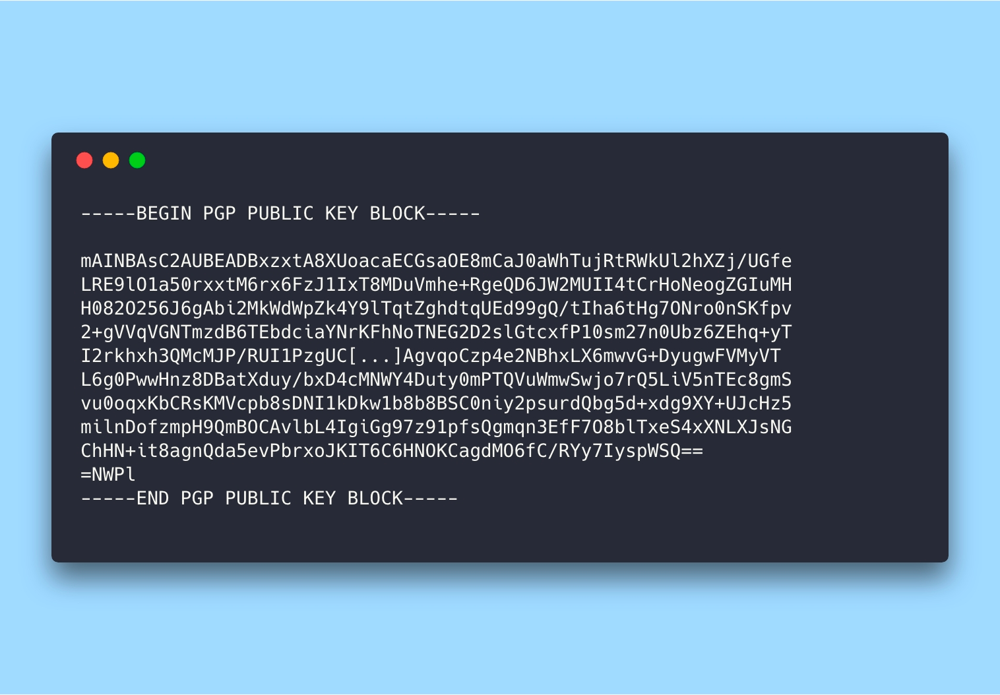

### Sign commit
1. install GPG
2. enable gpgsign feture
   
   ```
   git config commit.gpgsign true
   ```
3. generate sign key for computer
   ```
   gpg --full-generate-key
   ```
   - RSA and RSA
   - 4096
   - 1 year (recommended)
   - name
   - email as in GitHub
4. output all generated key in the computer
   ```
   gpg --list-secret-keys --keyid-format LONG
   ```
5. export key
   ```
   gpg --armor --export 3AA5C34371567BD2
   ```
   
6. Copy and add in GitHub SSH and GPG keys
   
7. ```
   git config user.name "name"
   ```
8. ```
   git config user.email "email"
   ```
9. ```
   git config user.signingkey "signingkey form 4 step"
   ```

### !!!!Attention: 
If don't work:
- run in terminal: ```gpgconf --kill gpg-agent```
- use manual commit: ```git commit -S -m your commit message```. Cause need enter passphrase, maybe
